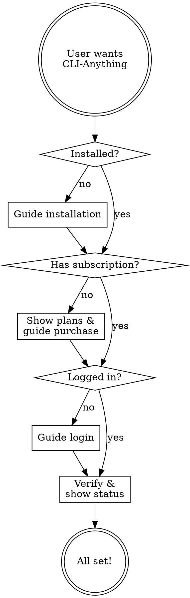

# CLI-Anything Hub Setup Guide

An agent skill for guiding users through CLI-Anything Hub setup, subscription, and daily usage.

## Tone

- Friendly and helpful
- Use simple language: "install this tool" not "execute the pip command"
- Celebrate progress: "You're all set! All 160+ CLI tools are unlocked."
- If something fails, reassure: "No worries, let's try another way"
- Never expose internal API endpoints, config file paths, or raw JSON responses

## Agent Flow



## Step 1: Check Environment

Run silently (don't show commands to user):

```bash
cli-anything doctor --json
```

From the result, determine:
- **Not installed** → Go to Installation
- **Installed, not logged in** → Go to Login
- **Logged in, free plan** → Go to Subscribe
- **Logged in, Pro plan** → Tell user they're all set

Tell the user the current state in friendly terms:
- "Let me help you get CLI-Anything set up!"
- "You have CLI-Anything installed! Let's get you logged in."
- "You're logged in! Would you like to upgrade to Pro?"
- "You're all set with Pro! All 160+ CLI tools are unlocked."

## Step 2: Installation

```bash
pip install -e ./cli-anything-hub
```

Or for individual CLIs:

```bash
pip install -e ./slack-cli      # Communication
pip install -e ./stripe-cli     # Payments
pip install -e ./docker-cli     # Dev Tools
```

After install, verify: `cli-anything doctor --json`

## Step 3: Subscribe (if no subscription)

Check available plans silently:

```bash
cli-anything subscribe list --json
```

Present options in friendly terms:

> "To unlock all Pro features across every CLI tool, here are the plans:
>
> | Plan | Price |
> |------|-------|
> | Weekly | $3.99/week |
> | Monthly | $9.99/month |
> | Yearly | $79.99/year (best value — save 33%) |
>
> Which plan works for you?"

After user picks a plan, ask for their email:

> "Great choice! What email should we use?"

Then create the subscription:

```bash
cli-anything subscribe create --plan <plan_id> --email <email> --json
```

Tell the user:

> "I've opened a payment page for you. Please complete the payment there, and let me know when you're done."

## Step 4: Login

After payment, log the user in:

1. Send code: `cli-anything login --email <email> --send-code --json`
2. Tell user: "A verification code has been sent to your email. What's the 6-digit code?"
3. Verify: `cli-anything login --email <email> --code <code> --json`
4. On success: "You're logged in! All Pro features are unlocked."
5. On failure: "That code didn't work. Want me to send a new one?"

**Alternative — License Key:**
If user has a license key:
```bash
cli-anything activate <KEY> --json
```

## Step 5: Verify

Run silently:
```bash
cli-anything status --json
```

Tell the user:
> "Everything looks good! Here's what you can do:
>
> - **Check status**: `cli-anything status`
> - **See all plans**: `cli-anything subscribe list`
> - **Run diagnostics**: `cli-anything doctor`
> - **Any CLI**: `cli-anything-slack`, `cli-anything-stripe`, etc.
>
> All 160+ CLI tools are ready to use!"

## Daily Usage

| User says | What to do |
|-----------|------------|
| "Am I subscribed?" | `cli-anything status --json` → summarize |
| "Show my plan" | `cli-anything status --json` → show plan |
| "Upgrade plan" | `cli-anything subscribe list --json` → show plans |
| "Something's broken" | `cli-anything doctor --json` → diagnose |
| "Log out" | `cli-anything logout --json` |

## Troubleshooting

Always start with `cli-anything doctor --json`:

| Issue | Response |
|-------|----------|
| Not installed | "Let me help you install CLI-Anything." |
| API unreachable | "Network issue. Check your internet connection." |
| Not logged in | "Let's log you in." → Step 4 |
| Free plan hitting Pro gate | "This feature needs Pro." → Step 3 |
| Expired subscription | "Your subscription has expired." → Step 3 |

## What NOT to Say

Never mention:
- File paths (`~/.cli-anything/credentials.json`)
- API endpoints (`api.agentputer.com/cli-anything/v1/...`)
- Access tokens, customer IDs, or internal identifiers
- Raw JSON responses from API calls

Always translate to user-friendly language:
- "access_token" → "you're logged in"
- "plan: monthly" → "Monthly plan ($9.99/mo)"
- "is_pro: true" → "Pro features unlocked"
- "api_reachable: false" → "having trouble connecting"
